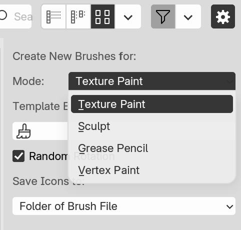
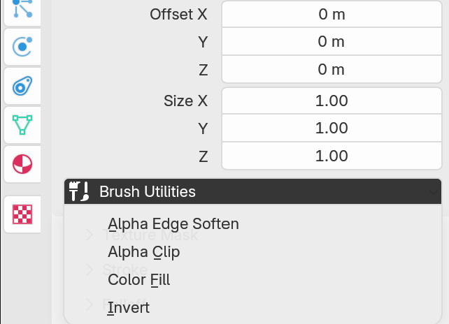

# Import Paint Brush: Blender Add-on

This is an add-on that converts brush assets of several popular painting software to Blender ones.

- Supported brush formats: `.abr`, `.gbr`, `.brushset`, `.sut`
- Supported Blender modes: `Texture Paint` / `Sculpt` / `Vertex Paint` / `Grease Pencil`

## Installation

The add-on works with Blender 3.3 or newer versions:

1. Download the archive file from the GitHub Release page. Do not unzip it.
2. In Blender, open `[Edit]->[Preferences]->[Add-ons]` and click the Install button to load the archive. Enable the installed add-on.

## Usage

### Import Brush Files

The import operator is available in the menu `[File]->[Import]`. Multiple brush files can be selected at once.

Please make sure to select the Blender mode where the brush will be used. The imported brush will be displayed in the selected mode only.

### Modify Brush Textures

It is possible that some brushes are not fully compatible with Blender, and their textures may not fit well. In this case, the add-on also provides with some image utilities to modulate the color/alpha channels of imported textures. These utilities are available as a menu in the brush tool settings: `[Tool]->[Brush Settings]->[Texture]`.

### Tips

- Please make sure to follow the license of the original brush asset. 
- It may take a long time to parse a file with high resolution (e.g. > 2000px) textures or multiple brushes. For frequently used brushes, it is recommended to save them as Blender assets, instead of importing them every time.
- Only brush files containing texture images can be converted by this add-on. Brushes exported with only parameters cannot be imported. Such brushes usually have a very small file size.

## Credits

The parsing of brush formats is learned from the following documents/projects:

- [Adobe Photoshop File Format Specification](https://www.adobe.com/devnet-apps/photoshop/fileformatashtml/)
- [GIMP Source Code](https://github.com/GNOME/gimp/)
- ["Just Solve the File Format Problem" Wiki](http://fileformats.archiveteam.org/wiki/Photoshop_brush)