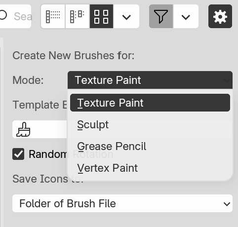
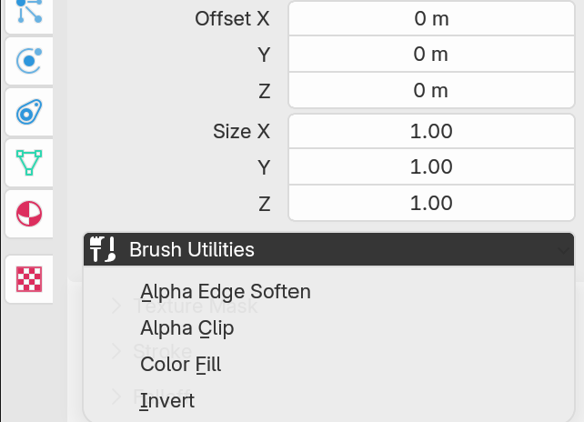

# Import Paint Brush: Blender Add-on

This is an add-on that converts brush assets of several popular painting software to Blender ones.

- Supported brush formats: `.abr`, `.gbr`, `.brushset`, `.sut`, `.bundle`
- Supported Blender modes: `Texture Paint` / `Sculpt` / `Vertex Paint` / `Grease Pencil`

## Installation

The add-on works with Blender 3.3 ~ 5.2:

1. Download the archive file from the GitHub Release page. Do not unzip it.
2. In Blender, open `[Edit]->[Preferences]->[Add-ons]` and click the Install button to load the archive. Enable the installed add-on.

> Alternatively, the add-on is also available at the [official extensions platform](https://extensions.blender.org/add-ons/import-paint-brush/). The functionalities are the same with the GitHub version, except that it requires Blender 4.2 or later.

## Usage

### Demo Video
https://youtu.be/STM5eU0PRvo

### Import Brush Files

The import operator is available in the menu `[File]->[Import]`. Multiple brush files can be selected at once.

Please make sure to select the Blender mode where the brush will be used. The imported brush will be displayed in the selected mode only.

### Modify Brush Textures

It is possible that some brushes are not fully compatible with Blender, and their textures may not fit well. In this case, the add-on also provides with some image utilities to modulate the color/alpha channels of imported textures. These utilities are available as a menu in the brush tool settings: `[Tool]->[Brush Settings]->[Texture]`.

### Animated Texture

Some brush formats such as `.gih` and `.sut` allow a single brush to have multiple texture images, which is not natively supported by Blender. However, the [Animated Texture Brush](https://extensions.blender.org/add-ons/animated-brush/) add-on makes this possible by loading multiple textures as an image sequence.

By default, this add-on splits a multi-texture brush into individual ones. There is also an option `Import Brush as Image Sequence` that makes the brush compatible with Animated Texture Brush.

### Tips

- Blender stores brushes in the current `.blend` file. To reuse the converted brushes in other files, please save the file to your [asset library](https://docs.blender.org/manual/en/latest/files/asset_libraries/introduction.html#what-is-an-asset-library).
- This add-on can only convert brush files that contain pixel texture images.
  - For Krita brushes, the [Pixel Engine](https://docs.krita.org/en/reference_manual/brushes/brush_engines/pixel_brush_engine.html) is the only supported brush type. Besides, brushes with SVG textures are also not supported.
  - For Procreate brushes, some exported brushes store only parameters but no texture images. These brushes cannot be imported, which can usually be identified by their small file size.
- Please ensure that you comply with the copyright and licensing terms of the original brush assets. This tool only provides format conversion and does not grant you any additional rights to use or redistribute the converted brushes.

## Credits

The parsing of brush formats is learned from the following documents/projects:

- [Adobe Photoshop File Format Specification](https://www.adobe.com/devnet-apps/photoshop/fileformatashtml/)
- [Procreate Help: Brush Studio Settings](https://help.procreate.com/procreate/handbook/brushes/brush-studio-settings)
- [Clip Studio Paint Official User Guide](https://help.clip-studio.com/en-us/manual_en/240_brushes/Customizing_brush_tools.htm)
- [GIMP Source Code](https://github.com/GNOME/gimp/)
- ["Just Solve the File Format Problem" Wiki](http://fileformats.archiveteam.org/wiki/Photoshop_brush)
- [Krita Wiki](https://community.kde.org/Krita/Photoshop_Mapping_Table)
- [Brush-viewer by jlai](https://github.com/jlai/brush-viewer)
